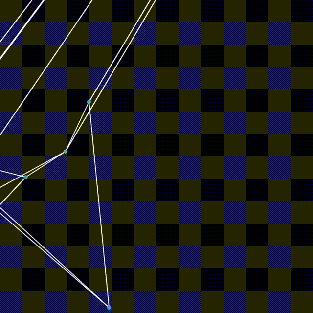

# Particle Simulation Library
## Description
This is a simple and flexible particle simulation library written in C. It prioritizes user-customizability and control, allowing for custom particle properties, interactions, and printed information. The example animations were generated in Mathematica, using the programs in the examples folder.
## Examples
I have so far made simple 1D kinematics, n-body gravity, and force-directed network programs using this framework. Using the csv output, I animated the results of these in Mathematica, shown below:




## Overall Structure
The overall structure of each program should more-or-less mirror the following:
```c

#include "../simrequired.h"

set_members(Particle, MEMBER_LIST)
#define I_DEFINED_PARTICLES

#include "../simfunctions.h"

// SUPPORTING FUNCTIONS
// At this point, all of Particle, Force, Passive, and Metric + their Vectors are defined

int main (void)
{

	ParticleVector pv = init_ParticleVector();
	//...

	Passive pas;
	pas.apply = pas_function;
	push_Passive(&pasv, &pas);

	Force f;
	f.acts_on = 2; // 1 or 2
	f.test_function = test_function; // pointer to a function taking Particle**, tests whether to apply
	f.apply_function = apply_function; // pointer to a function taking Particle**, applies to particles
	push_Force(&fv, &f);
    // NOTE THAT THE INCLUDED FUNCTION apply_forces LATER HANDLES THE PAIRWISE COMBINATIONS FOR PARTICLE **'s

	Particle p;
    // set user-defined particle members
    push_Particle(&pv,&p);

	Metric m;
	m.print = print_function; // This is recommended to be some property of a single particle like position
	push_Metric(&mv, &m);

	for (int t = 0; t < 20; t++) // How long to run the simulation
	{
		print_metrics(&mv, &pv); // For each metric in mv, prints the result for each particle
		apply_forces(&fv, &pv); // For each force in fv, tests and applies force_function to each single/pair of particles
		apply_passives(&pasv, &pv); // For each passive in pasv applies pas_function to each particle
	}

	return 0;
}
```

## Types
There are four built-in types, three of which come defined, those being Force, Passive, and Metric. Particle must be defined as specified in the following section. The set_members(TYPE, MEMBERS) macro defined in simrequired.h allows you to define a type TYPE with members MEMBERS (separated by semicolons). set_members also populates a TYPEVector type and push_TYPE function.
### Particle
The Particle type must be defined by the user (and confirmed by #define I_DEFINED_PARTICLES) before simfunctions.h may be included. The Particle type is of central importance to this framework, as the other pre-determined types reference Particle. 
### Force
The Force type has members
``` c
		int (*test_function) (Particle **)
		void (*apply_function) (Particle **)
		int acts_on;
```
This structure requires the user define test_function and apply_function based on the simulation being designed. 
### Passive
The Passive type has one member:
```c
		void (*apply)(Particle *)
```
While any Passive could be implemented as a Force, it is good to keep them conceptually and mechanically separated.

### Metric
The Metric type has one member:
```c
		void (*print)(Particle *);
```
This type allows you to print a calculation depending on the properties of the given Particle. A possible future feature of this project may be calculations based on the whole of a ParticleVector (e.g. entropy), though one should be able to implement that themselves without much difficulty.

## Built-In Functions and Macros
### set_members
Usage:
```c
set_members(TYPE, semicolon separated; list of; struct members;)
```
What it does:
Defines a struct named TYPE with members in the lsit, defines a TYPEVector struct, makes a push_TYPE function to manipulate the TYPEVector.
### always_true
Usage:
```c
Particle p;
(Particle *) pv[1] = {&p};
always_true(&p); // always returns 1

Force f;
f.test_function = always_true;
```
You often want forces to always apply to the passed particle, but the test_function must check those passed particles. This function is for that case.
What it does:
Takes an array of Particle pointers, always returns 1.
### size_to_console
Usage:
```c
    size_to_console(Type)
```
What it does:
It prints the size of Type to the terminal using the stderr output stream (so it doesn't mess with regular redirected output).
### apply_forces
Usage:
```c
ForceVector fv;
ParticleVector pv;
apply_forces(&fv,&pv);
```
What it does:
Runs over every Force, f, in fv, checking and applying f appropriately to each Particle (if f acts on one) or pair of Particles (if f acts on two).
### apply_passives
Usage:
```c
PassiveVector pasv;
ParticleVector pv;
apply_passives(&pasv,&pv);
```
What it does:
Runs over each Passive, p, in pasv, applying p to each Particle in pv.
### apply_metrics
Usage:
```c
ForceVector mv;
ParticleVector pv;
apply_metrics(&mv,&pv);
```
What it does:
Runs over each Metric, m, in mv, applying m to each Particle in pv.
## Final Comments
This project is not super polished or really near finished. There's a lot I would add, test, and increase safety on. It was a really great learning experience, though.
